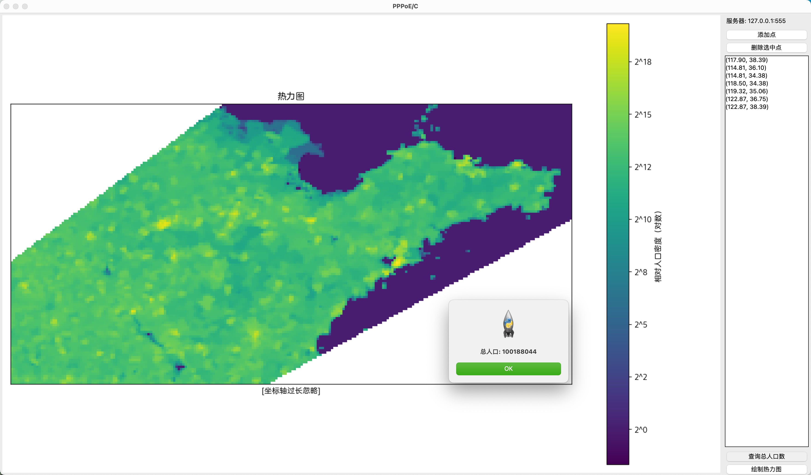

# PPPoE

> Population Patterns Plotting over Earth

这是一份北京邮电大学计算机科学与技术专业 2021 级大三上（2023–2024 学年度秋季学期）《Python 程序设计》课程大作业。

作业题目是利用给定的人口数据（一个 $21600 \times 43200$ 的浮点数矩阵）实现一对用于人口数查询与热力图绘制的服务器和客户端。要求能够处理一个凸包（不一定是矩形）内的查询。

更多信息参见[报告](doc/report.pdf)。

> [!CAUTION]
> 仓库不附带人口数据，请自行获取并放置在 `assets/gpw_v4_population_count_rev11_2020_30_sec_asc`
目录下，若需修改请自行阅读代码。

## 运行截图

